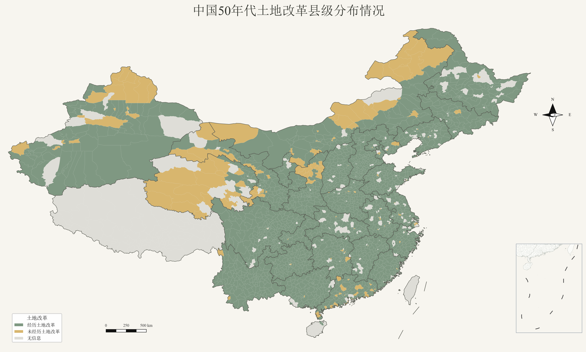

::: {.hero}
::: {.hero-inner}
# China Gazetteer Land Reform Database

::: {.en}
China-Gazetteer-LandReform
:::

A county-level database on China’s land reform, constructed from provincial, municipal, county, and district gazetteers, to support research on land redistribution, class structure, economic history, and regional comparison.
:::
:::

::: {.container-narrow}
::: {.stats}
::: {.stat}
**30**
Provinces / Autonomous Regions / Municipalities
:::
::: {.stat}
**County-level**
Observation Units
:::
::: {.stat}
**600+**
Standardized Variables
:::
::: {.stat}
**V1.0**
Current Version
:::
:::
:::

::: {.map-card}

::: {.map-image-wrap}
[{.coverage-map-image fig-alt="County-level Land Reform Experience Map"}](../assets/images/county_land_reform_experience.png){target="_blank"}
:::
:::

::: {.band .alt}
::: {.container-narrow}

## Database Highlights {.section-title}

::: {.cards}
::: {.card}
### Unified Statistical Framework

A unified system of data organization, variable definitions, and coding standards to improve the comparability of cross-regional research.
:::
::: {.card}
### Based on Official Gazetteer Sources

Primarily based on newly compiled local gazetteers, with cross-validation using specialized gazetteers on agriculture, economy, and politics.
:::
::: {.card}
### Coverage of the Full Land Reform Process

Includes information on class classification, landholding, land redistribution, and the confiscation and allocation of productive assets and property.
:::
::: {.card}
### Standardized Variable Coding System

Preserves original records while providing standardized, structured, and source-labeled fields for comparison.
:::
::: {.card}
### Spatial and Historical Comparison

Uses unified administrative division codes and supports GIS matching, regional comparison, and historical geography research.
:::
:::
:::
:::