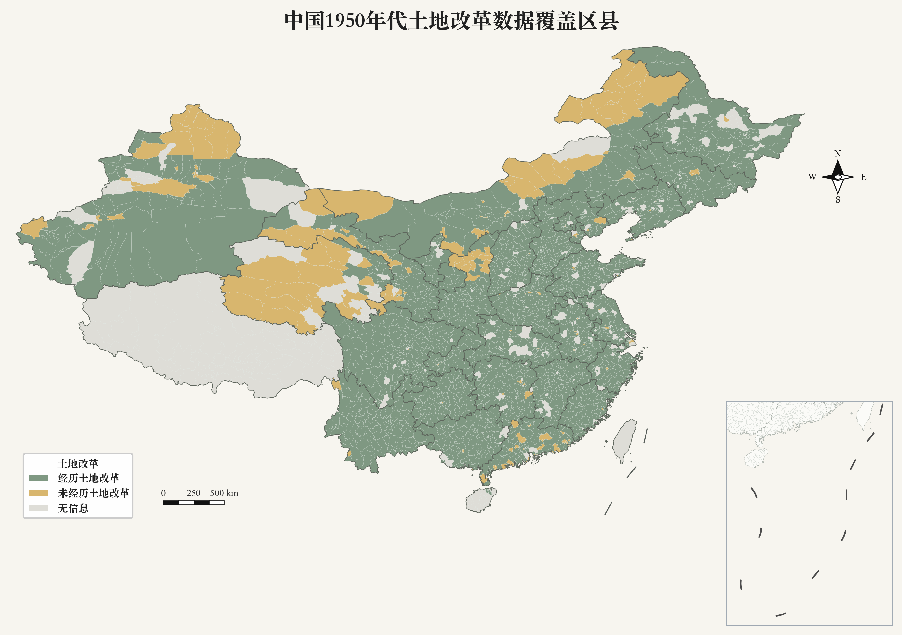

::: {.hero}
::: {.hero-inner}
# 中国地方志土地改革数据库

::: {.en}
China-Gazetteer-LandReform
:::

基于省志、市志、县志、区志等地方志资料，构建全国统一口径的土地改革县级数据集，服务土地再分配、阶级结构、经济史与区域比较研究。
:::
:::

::: {.container-narrow}
::: {.stats}
::: {.stat}
**30**
省 / 自治区 / 直辖市
:::
::: {.stat}
**县级**
观测单位
:::
::: {.stat}
**600+**
统一变量
:::
::: {.stat}
**V1.0**
当前版本
:::
:::
:::

::: {.map-card}

::: {.map-image-wrap}
[{.coverage-map-image fig-alt="县级土地改革经历地图"}](../assets/images/county_land_reform_experience_zh.png){target="_blank"}
:::
:::

::: {.band .alt}
::: {.container-narrow}

## 数据库亮点 {.section-title}

::: {.cards}
::: {.card}
### 全国统一口径

统一数据整理规范、变量定义与编码体系，提高跨地区比较研究的可行性。
:::
::: {.card}
### 基于官方地方志资料

以新修地方志为主，并结合农业志、经济志、政治志等专题志交叉验证。
:::
::: {.card}
### 覆盖土地改革全过程

整理阶级划分、土地占有、土地分配、生产资料和财产没收分配等信息。
:::
::: {.card}
### 标准化变量编码体系

保留原始记载，并对可比字段进行标准化、结构化和来源标记。
:::
::: {.card}
### 空间与历史比较

采用统一行政区划编码，支持 GIS 匹配、区域比较和历史地理研究。
:::
:::
:::
:::