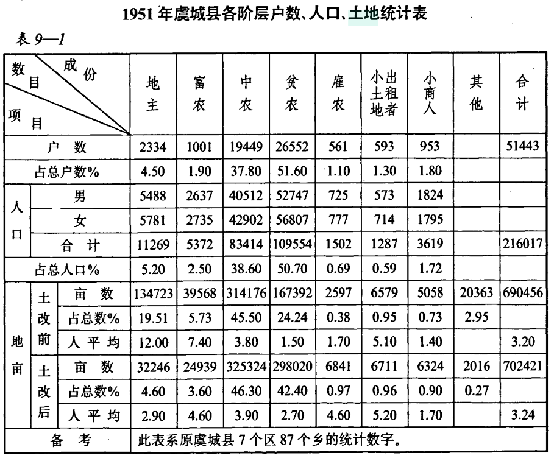
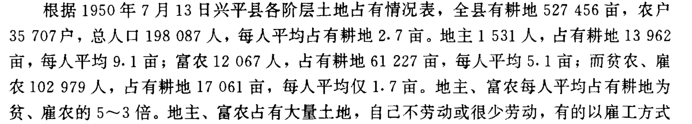

::: {.page-hero}
::: {.page-hero-inner}
# 数据来源与方法 {.unnumbered .unlisted}

说明地方志文献基础、数据收集范围、整理流程和资料完备性。
:::
:::

## 文献基础与主要来源 {#sources}

数据库以全国新修地方志为主要来源，同时结合专题志和其他公开历史资料，对土地改革相关信息进行系统整理和标准化录入。

地方志作为地方政府组织编纂的重要官方文献，具有系统性、连续性、权威性和地域性等特点，是研究中国地方经济社会发展和制度变迁的重要历史资料。本数据库主要利用地方志中关于农业、土地、政治、经济等章节所记录的土地改革信息，重建县级土地改革数据。

- 县志、市志、地区志、省志
- 农业志、土地志、经济志、政治志等专题志
- 其他公开历史资料，用于交叉核对与补充验证

## 数据收集范围 {#range}

核心资料为 20 世纪 80-90 年代出版的第一批新修地方志，重点记录 1949 年前后及改革开放初期情况，较完整地保存了土地改革时期的大量官方统计资料；2000 年以后出版的第二批新修地方志主要作为补充资料使用。

## 地方志原始资料示例 {#examples}

数据库中的土地改革信息主要来源于地方志中的文字记载和统计表格。为展示原始资料与数据库变量之间的对应关系，以下展示部分地方志原始资料示例，包括土地改革相关章节文字记录和统计表格。

### 土地改革统计表

地方志中保存了大量土地改革时期的统计资料，包括阶级户数、人口、土地面积、土地占有及分配情况等信息。项目根据统一变量定义，对相关字段进行提取、整理和标准化编码。

### 土地改革文字记载

除统计表格外，地方志中还包含大量关于土地改革过程、阶级划分、政策实施等方面的文字描述。项目通过人工识别和编码，将相关信息转化为结构化变量。

## 数据收集流程 {#workflow}

::: {.process}
::: {.process-step}
地方志收集
:::
::: {.arrow}
↓
:::
::: {.process-step}
确认行政区划
:::
::: {.arrow}
↓
:::
::: {.process-step}
确定土地改革章节
:::
::: {.arrow}
↓
:::
::: {.process-step}
识别数据类型
:::
::: {.arrow}
↓
:::
::: {.process-step}
数据录入
:::
::: {.arrow}
↓
:::
::: {.process-step}
数据校验
:::
::: {.arrow}
↓
:::
::: {.process-step}
标准化处理
:::
::: {.arrow}
↓
:::
::: {.process-step}
数据库发布
:::
:::

## 方志完备性说明 {#completeness}

由于地方志编纂时间、地区历史情况及保存状况存在差异，不同地区土地改革资料的完整程度存在一定差别。

::: {.cards}
::: {.card}
::: {.badge-soft}
第一类
:::

### 完整记录

同时具有土改经历、阶级划分、土地占有、土地分配与生产资料信息。
:::
::: {.card}
::: {.badge-soft}
第二类
:::

### 部分记录

具有部分土地改革文字描述或部分可量化信息。
:::
::: {.card}
::: {.badge-soft}
第三类
:::

### 资料缺失

地方志未记载、相关章节缺失或资料暂不可获得。
:::
:::

## 省份覆盖与行政区划 {#coverage}

目前覆盖中国大陆 30 个省（自治区、直辖市），以县（区）级行政单元为基本整理对象，并结合历史行政区划调整进行统一编码。对于因行政区划调整形成的市辖区、地区改市等情况，数据库依据历史行政区划进行对应整理，以保证历史数据的一致性。
